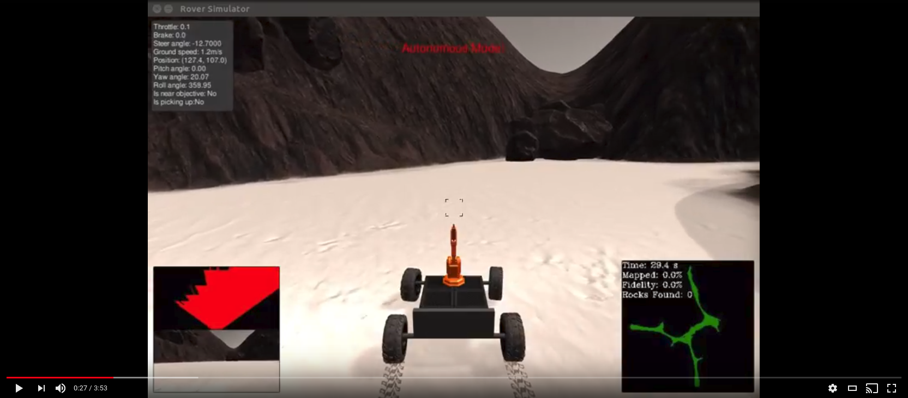

# Udacity Rover Search and Sample Project

This is the project implementation of the [Udacity RoboND-Rover-Project](https://github.com/udacity/RoboND-Rover-Project) which uses a simulator to autonomously navigate an enviroment modeled after the [NASA sample return challenge](https://www.nasa.gov/directorates/spacetech/centennial_challenges/sample_return_robot/index.html)

A video of the rover in action can be seen below.

 [](https://youtu.be/RxEsXVy2FaQ)

## Writeup

For a detailed description and walk through of the key areas of the code, visit the project website [here](https://www.haidynmcleod.com/search-and-collect-rover/Rover).
The [writeup.md](writeup.md) also contains details of the code and mathematical derivations used in this project.

---

## The Simulator
The simulator environment can be downloaded for the appropriate operating system.  Here are the links for [Linux](https://s3-us-west-1.amazonaws.com/udacity-robotics/Rover+Unity+Sims/Linux_Roversim.zip), [Mac](	https://s3-us-west-1.amazonaws.com/udacity-robotics/Rover+Unity+Sims/Mac_Roversim.zip), or [Windows](https://s3-us-west-1.amazonaws.com/udacity-robotics/Rover+Unity+Sims/Windows_Roversim.zip).  

For more information see the [Udacity project repo](https://github.com/udacity/RoboND-Rover-Project)

## Dependencies
You'll need Python 3 to run the simulator in Autonomous Mode and Jupyter Notebooks to view the perception run through file `Rover_Project_Test_Notebook.ipynb`. You can get setup with the [Udacity RoboND-Python-Starterkit](https://github.com/ryan-keenan/RoboND-Python-Starterkit).

Required packages
- OpenCV
- Numpy
- Matplotlib

## Navigating Autonomously
If you have all the required Python packages installed. Navigate to this projects directory and call it at the command line like this:

```sh
python3 ./code/drive_rover.py
```  

Then launch the simulator and choose "Autonomous Mode".  The rover should drive itself now!  It doesn't drive that well yet, but it's your job to make it better!  
